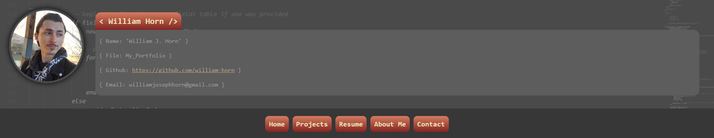

# My Portfolio [Revamp]
## Description
Welcome to my portfolio revamped! This application showcases some of my skills in web development through projects that I have either done completely from scratch, or have majorly contributed in. Enjoy!

[View deployed application here](https://william-horn.github.io/my-portfolio-revamp/)

## License

This application is distributed under the [MIT](https://opensource.org/licenses/MIT) license.
## Table of contents
- [License](#License)
- [About](#Usage)
- [Contributions](#Contributions)
## About
This is a revamped version of my original portfolio app. This rendition implements tons of new technologies that were not present in my previous portfolio application, such as:

* React
* JavaScript
* npm packages
* ...and more

## Contributors
* William J. Horn
## Questions
Find me on GitHub: <https://github.com/william-horn>

Reach me by email: williamjosephhorn@gmail.com

